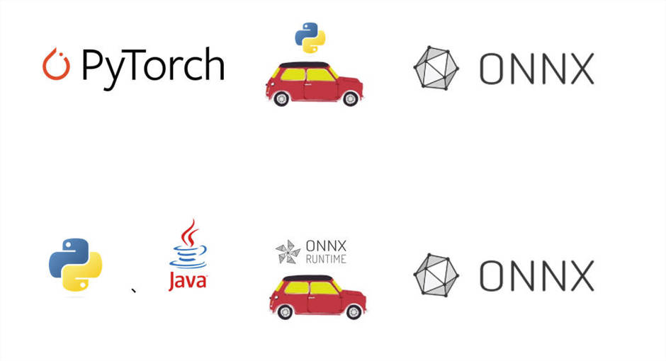

# 👇Project

# Python

python训练torch模型，并转换为onnx模型，并加载torch和onnx模型进行预测

# Java

java加载onnx模型并进行预测

# Realize

实现了python加载torch、onnx模型并预测的**输出一致**

实现了python加载onnx模型和java加载onnx模型并预测的**输出一致**

实现了python加载torch、onnx模型并预测的输出和java加载onnx模型并预测的**输出控制在最小范围**

# Document

[避坑🕳指南-onnx系列.md](https://gitee.com/jhcyun/py-onnx-java-demo/blob/master/python/%E8%B8%A9%E5%9D%91%E6%8C%87%E5%8D%97-onnx%E7%B3%BB%E5%88%97.md)