## 👇踩坑坑指南——onnx系列

目录：
- [👇踩坑🕳指南——onnx系列](#踩坑指南onnx系列)
  - [🕳1：转onnx时protobuf库报错](#1转onnx时protobuf库报错)
  - [🕳2：训练时protobuf库相关错](#2训练时protobuf库相关错)
  - [🕳3：torch转onnx：转整个模型好？还是转参数好？](#3torch转onnx转整个模型好还是转参数好)
  - [🕳4：如何使python调用torch和onnx模型的输出一致？](#4如何使python调用torch和onnx模型的输出一致)
  - [🕳5：如何使java、python加载onnx模型的输出一致？](#5如何使javapython加载onnx模型的输出一致)


## 🕳1：转onnx时protobuf库报错

- 描述：当运行torch转onnx的代码时，出现`ImportError: cannot import name 'builder' from 'google.protobuf.internal' `，如下图：

  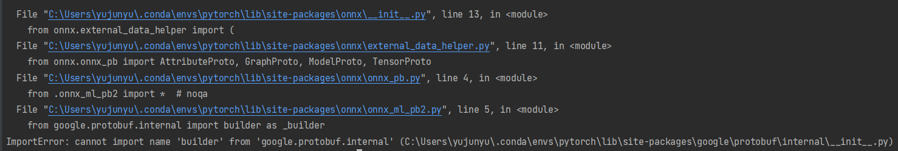

- 原因：由于使用的`google.protobuf`版本太低而引起的。在较新的版本中，`builder`模块已经移动到了`google.protobuf`包中，而不再在`google.protobuf.internal`中。

- 解决办法：升级protobuf库

  ```
  pip install --upgrade protobuf
  ```

  

## 🕳2：训练时protobuf库相关错

- 描述：当运行训练代码出现如下错误：

  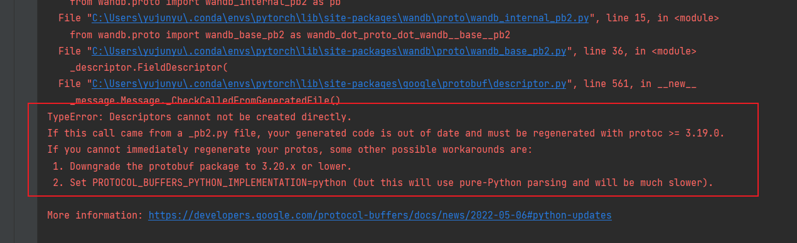

- 原因：由于protobuf`版本太高而引起的。在较新的`protobuf`版本中，为了改进性能，`Descriptor对象的创建方式发生了变化。

- 解决办法：降级protobuf库

  ```
  pip install protobuf==3.20.0
  ```

- 注：坑1与坑2之间是相互影响的，暂未找到其他更好解决办法，但目前办法可以解决相关报错，只是有些繁琐。


## 🕳3：torch转onnx：转整个模型好？还是转参数好？

- 前提：模型训练的时候保存的是`torch.save(net, 'model.pth')`，还是`torch.save(net.state_dict(), 'weight.pth')`，前者保存的是整个模型，后者保存的是参数。


- 关于torch转onnx模型，一开始认为转整个模型比较好是因为考虑了预测时需要重新定义神经网络结构，并且java那边定义神经网络可能比较复杂，然后就转整个模型。之后发现不管是转整个模型还是参数，在python这边调用onnx并预测并不需要重新定义神经网路结构，所以建议训练的时候只保存参数即可，torch转onnx时也只转参数，在转onnx需加载网络结构。具体torch转onnx的最小代码如下：

  ```python
  import torch
  import torchvision
  import onnx
  # 调用自定义网络结构
  from net import Net
  
  # 加载PyTorch模型
  model = Net()
  weight = torch.load('./weight/model.pth')
  model.load_state_dict(weight)
  
  # 设置模型输入
  dummy_input = torch.randn(1, 3, 224, 224)
  
  # 导出ONNX模型
  torch.onnx.export(model, dummy_input, 'weight/model.onnx', verbose=True)
  ```

- 代码解析：当前代码转的是模型参数；
  - 第一步：先重新加载定义好的神经网络结构，然后加载model.pth并加载参数；
  - 第二步：设置模型输入，取决于定义的Ne的输入；
  - 第三步：导出onnx模型，正常情况传三个参数即可（第一个：模型；第二个：模型输入；第三个：导出模型路径），verbose默认为False，设置为True，会打印模型输出至onnx的过程，便于确定模型转成功了。
- 总结：关于torch和onnx后续使用python调用并且预测时，转整个模型还是转参数是否会导致两者输出不一致的结果没有进行对比验证，但是基于目前本人踩坑到现在，最终torch和onnx的输出一致了，使用的正是转参数，关于torch和onnx的输出不一致的问题见【🕳4】。所以总的来说，在torch转onnx时，还是转参数就行，毕竟在训练的时候只保存参数会比保存整个模型更快，何为不好呢？


## 🕳4：如何使python调用torch和onnx模型的输出一致？

- 描述：在python开发这边，训练完模型后，并将torch模型转onnx模型后，使用python加载torch模型和onnx模型进行预测同一张图片，打印模型输出及softmax后的输出，出现严重不一致，按理来说同一个模型不同格式，最终输出一个保持一致。

- 原因：python预测的时候transforms.Resize()内的插值，与onnx中cv2.resize()内的插值不一致。

- 解决办法：

  - 办法1：**将onnx中resize操作使用transfroms.Resize()**，确保torch和onnx模型进行预测中的resize确保一致（还得保证训练时预处理的resize，三者保持一致），且resize内的interpolation插值类型一致。

    - 如图：onnx中使用transfroms.Resize()，输出如下：

      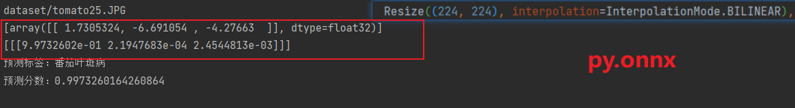

    - 如图：torch不变，使用transforms.Resize()，输出如下：

      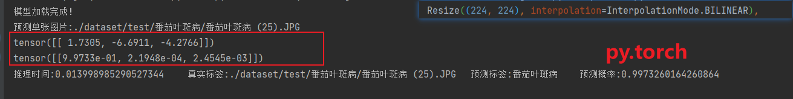

  - 办法2：**将torch中的resize操作使用cv2.resize()**，将torch的transforms.Resize()重写，把里面的resize改成cv2的resize；（[详见🕳5](#5如何使javapython加载onnx模型的输出一致)
  ）

- 总结：确保python中【训练时预处理的resize】、【torch模型预测时的resize】、【onnx模型预测时的resize】中的插值方法保持一致。


## 坑🕳：如何使java、python加载onnx模型的输出一致？

- 描述：在🕳五中已经解决了python中调用torch和onnx模型预测的输出一致，但是为了和java对接上，需要保证【python调用onnx模型预测的输出】和【Java调用onnx模型预测的输出】保持一致，如何保持一致？一开始java那边使用的opencv的resize，python这边使用的是transforms.Resize()，但是运行结果仍不一致，尽管是transforms.Resize()中使用的是的插值法是`Resize(shape,interpolation=InterpolationMode.BILINEAR)`,java那边使用的是`cv2.INTER_LINEAR`,虽然两者都线性，前者为双线性，后者为线性，但是最终输出结果会有出入；

- 原因：java的cv2.resize和python的transforms.Resize中的插值方法不一样；

- 解决办法：将torch中的resize操作使用cv2.resize()。

  - 1）重写Resize：

    ```python
    import torch
    import numpy as np
    from PIL import Image
    import cv2
    from collections.abc import Sequence
    
    class CV2_Resize(torch.nn.Module):
        def __init__(self, size, interpolation=cv2.INTER_LINEAR, max_size=None, antialias=None):
            super().__init__()
            if not isinstance(size, (int, Sequence)):
                raise TypeError(f"Size should be int or sequence. Got {type(size)}")
            if isinstance(size, Sequence) and len(size) not in (1, 2):
                raise ValueError("If size is a sequence, it should have 1 or 2 values")
            self.size = size
            self.max_size = max_size
            self.interpolation = interpolation
            self.antialias = antialias
    
        def forward(self, img):
            if isinstance(img, torch.Tensor):
                img = img.permute(1, 2, 0).cpu().numpy()
                img = cv2.resize(img, self.size[::-1], interpolation=self.interpolation)
                img = torch.from_numpy(img).permute(2, 0, 1)
            else:
                img = np.array(img)
                img = cv2.resize(img, self.size[::-1], interpolation=self.interpolation)
                img = Image.fromarray(img)
                if self.max_size is not None:
                    w, h = img.size
                    if w > h:
                        new_w = self.max_size
                        new_h = int(h * (self.max_size / w))
                    else:
                        new_h = self.max_size
                        new_w = int(w * (self.max_size / h))
                    img = img.resize((new_w, new_h), resample=Image.BILINEAR)
            return img
    
        def __repr__(self) -> str:
            detail = f"(size={self.size}, interpolation={self.interpolation}, max_size={self.max_size}, antialias={self.antialias})"
            return f"{self.__class__.__name__}{detail}"
    ```

  - 2）然后在训练时预处理使用重写的Resize，重新训模型：

    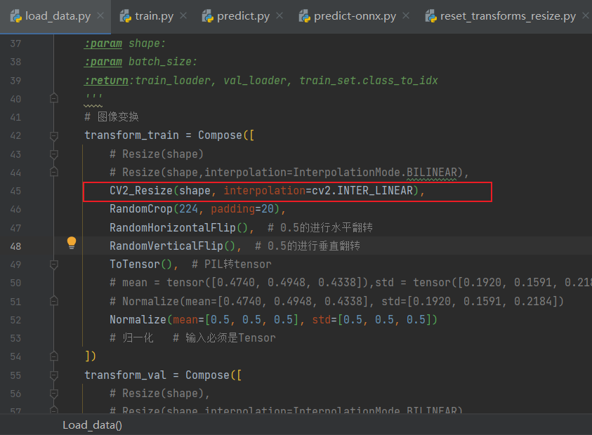

  - 3）训好转onnx后，使用python加载onnx模型并预测，输出结果，但下面使用的是重写的Resize：

    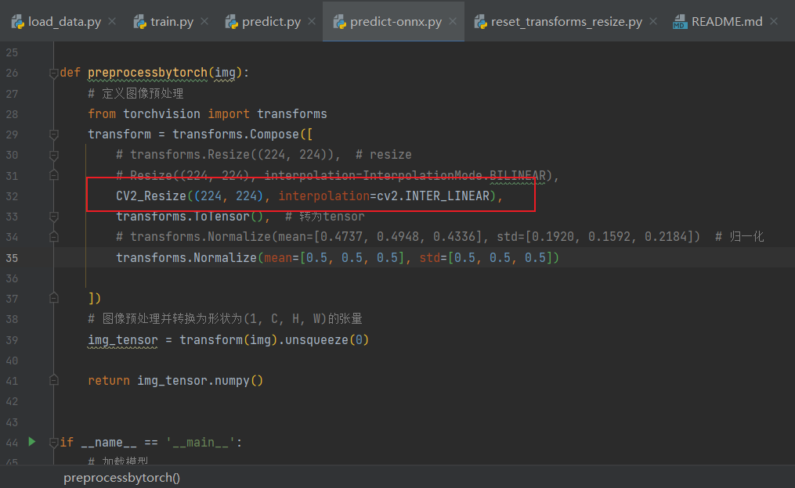

    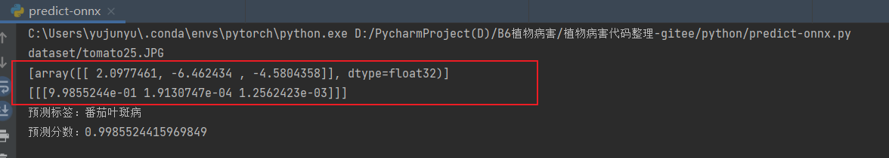

  - 4）使用java加载onnx模型并预测，输出结果:

    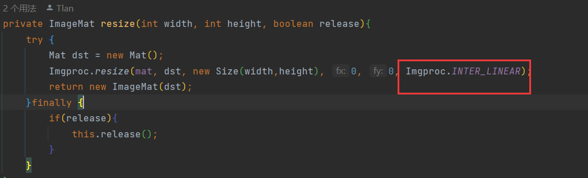

    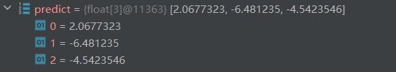

  - 但我们使用python加载onnx时，resize应该直接使用cv2.resize()

    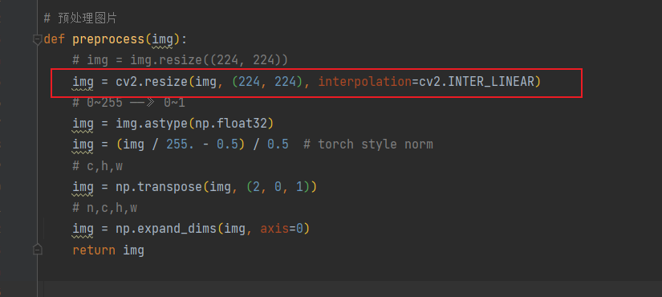

    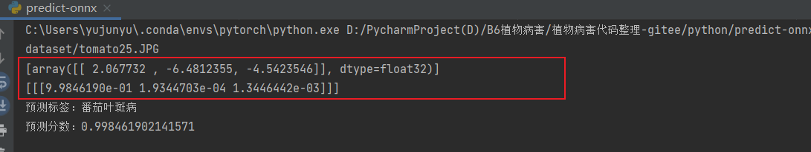

  - 通过上面对比验证，可以发现【使用python加载onnx，使用cv2.resize】和【java加载onnx，使用cv2的resize】（且插值方法保持一致的情况下），两者输出保持一致，但【py加载onnx，cv.resize】和【py加载torch，重写的Resize】或【py加载onnx，重写的resize】之间的输出仍有出入，但范围已经控制在最小范围了。

    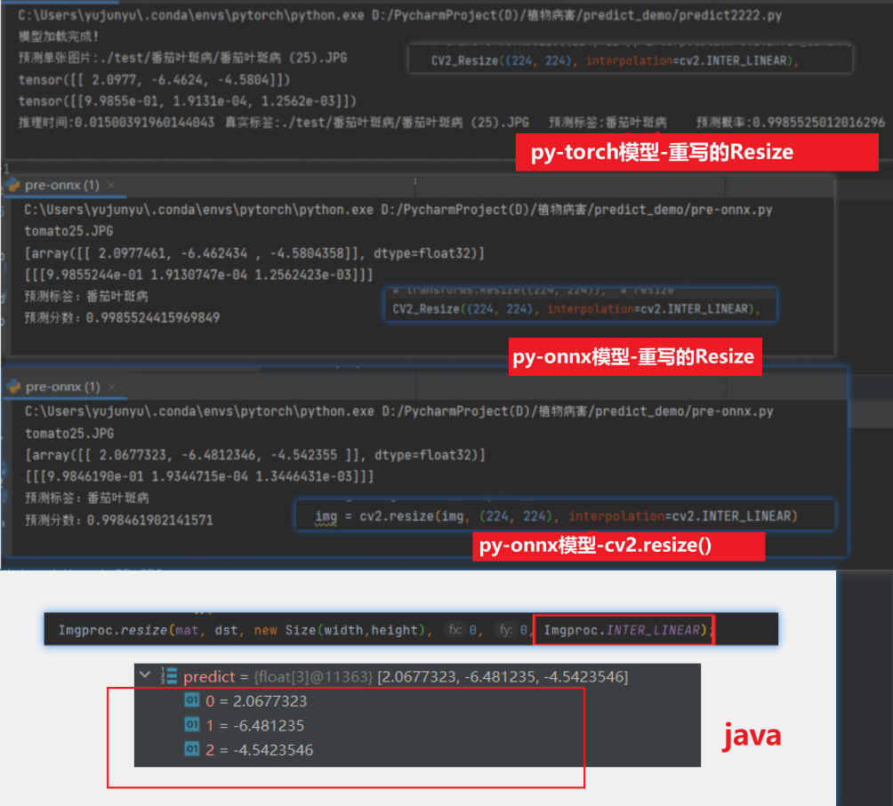

- 总结：确保java的cv2.resize和python的transforms.Resize中的插值方法完全一样。


  

